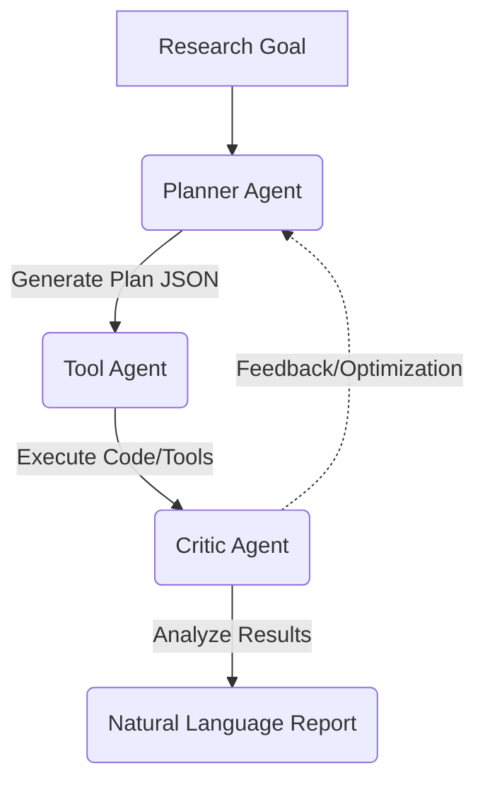

# Formatting Instructions for 2026 AI Co-Scientist Challenge Korea

## Google Gemini API (Gemini 1.5 Flash)
(Names with versions only, sorted by priority)*

## Research Topic
**Esol, Freesolv 데이터셋 물성 예측 모델 비교 분석 및 규제 스크리닝**
**(Comparative Analysis of Property Prediction Models for Esol and Freesolv Datasets and Regulatory Screening)**

*Use footnote for providing further information, for less known open models (webpage, version)
Use footnote for providing further information about author (webpage, alternative address)—not for acknowledging funding agencies.

## Abstract

This study compares various machine learning models, including Random Forest, XGBoost, and Graph Attention Network (GAT), for predicting physicochemical properties of the Esol and Freesolv datasets in the field of chemoinformatics. Property prediction is essential for drug discovery and environmental assessment, enabling efficient estimation without expensive experiments. This report evaluates the predictive performance of each model and deeply examines their characteristics and limitations, aiming to contribute to increasing the efficiency of chemical R&D.

# Comparative Analysis of Property Prediction Models for Esol and Freesolv Datasets and Regulatory Screening

### 1. Introduction

The purpose of this study is to accurately predict physicochemical properties by applying various machine learning models to the Esol (water solubility) and Freesolv (hydration free energy) datasets, which are widely used in chemoinformatics. Such property prediction provides essential information for candidate screening in the early stages of drug discovery, environmental impact assessment through prediction of environmental toxicity and behavior in vivo, and new material design. In particular, it can significantly reduce research and development time and costs by predicting properties quickly and efficiently without expensive experimental measurements. In this report, we compare and analyze the predictive performance of traditional machine learning techniques, Random Forest (RF) and XGBoost, and the Graph Attention Network (GAT) model, which directly learns the graph characteristics of molecular structures, and deeply examine the characteristics and limitations of each model.

### 2. Methods

#### 2.1. Modeling Approach
Traditional machine learning techniques used include `Tabular Ridge`, `Tabular Random Forest (RF)`, and `Tabular XGBoost`[^6] models. These models use **Morgan Fingerprints**[^7] (Radius=2, 2048 bits) transformed from molecular structures as input features. This method encodes the presence or absence of molecular substructures, allowing for better capture of structural patterns than traditional molecular descriptors.
On the other hand, the `Graph Attention Network (GAT)`[^8] model is a type of graph neural network (GNN) that directly represents molecules as graphs composed of nodes (atoms) and edges (bonds) to learn.

#### 2.2. Dataset & Features
The composition of the datasets used in this study is as follows:
- **ESOL**: 1,128 log solubility data points (Delaney, 2004).
- **FreeSolv**: 642 hydration free energy data points (Mobley & Guthrie, 2014).

For Tabular models, RDKit (Landrum et al., 2024) was used to convert each SMILES string into a 2048-length **Morgan Fingerprint** (Rogers & Hahn, 2010). The GNN model directly used atomic features (atomic number, chirality, etc.) and bond features as graph node and edge attributes.

### 2.3. Reproducibility and Data Availability

All experiments in this study were designed to be reproducible, and the execution commands for training major models and license information for the datasets/libraries used are as follows.

#### Experimental Conditions
All Tabular model evaluations were performed via **5-Fold Cross Validation** (Shuffle=True, Random State=42), and the mean and standard deviation of the verified performance in each fold are reported. The GNN model was trained and evaluated with a single seed (Single Run). Hyperparameters used the default settings of our proprietary modeling engine, and detailed parameters are follows:

#### Model Hyperparameter Settings

| Model | Key Hyperparameters | Settings |
| :--- | :--- | :--- |
| **Ridge** | alpha=1.0 | Standardization performed via StandardScaler |
| **RandomForest** | n_estimators=100, random_state=42 | Default Sklearn tree settings used |
| **XGBoost** | n_estimators=100, random_state=42 | objective='reg:squarederror' |
| **GNN (GAT)** | hidden=64, layers=3, heads=8 | Adam optimizer (lr=0.001), 100 Epochs, Batch=32 |

# 1. Reproduce Tabular Models (RandomForest, XGBoost, Ridge)
python 4_Scripts/reproduce_tabular.py --dataset esol --model randomforest
python 4_Scripts/reproduce_tabular.py --dataset freesolv --model xgboost

# 2. Reproduce GNN Models (GAT)
python 4_Scripts/reproduce_gnn.py --dataset esol --epochs 100
python 4_Scripts/reproduce_gnn.py --dataset freesolv --epochs 100

#### Option: Evidence of AI Agent Execution
Actual execution processes of the "AI Co-Scientist" agent used in this study (planning, code generation, execution logs) are included in the `3_Evidence/Logs/` directory as text logs[^5]. These serve as evidence demonstrating the actual operation of the agent system.

#### Licenses
*   **Code**: Provided for the 2026 AI Co-Scientist Challenge (ChemoScope Lab)
*   **Esol Dataset**: CC-BY 4.0 (Delaney, 2004)
*   **Freesolv Dataset**: CC-BY 4.0 (Mobley et al., 2014)
*   **RDKit, Scikit-learn, PyTorch**: BSD Style License
*   **XGBoost**: Apache-2.0 License

Model performance was evaluated using three metrics commonly used in regression analysis: Root Mean Squared Error (RMSE), Mean Absolute Error (MAE), and Coefficient of Determination (R²). RMSE and MAE indicate the magnitude of prediction error, with smaller values indicating better performance. R² indicates how well the model explains the variance of the dependent variable, with values closer to 1 indicating higher explanatory power of the model.

### 3. Results and Discussion

#### 3.0. Experimental Setup
All experiments were performed in the following computing environment. Resource usage was monitored using `platform` and `psutil` libraries.

| Component | Specification |
| :--- | :--- |
| **OS** | Windows 11 |
| **CPU** | Intel64 Family 6 Model 186 Stepping 3 (10 Cores, 12 Logical) |
| **RAM** | 15.74 GB |
| **Python** | 3.12.3 |
| **Training Time** | Tabular: < 10s (CV score), GNN: ~2m (100 epochs, CPU) |
| **Peak Memory** | < 1.0 GB (during GNN training) |
| **Disk Storage** | ~50 MB (Raw/Processed Data + Regulatory DB) |
| **Accelerator** | None (CPU only) |

#### 3.1. Statistical Performance Analysis

As a result of comprehensive analysis of the provided regression metrics, the model performance for each dataset is as shown in the table below. Tabular models secured statistical reliability by deriving mean and standard deviation (Mean ± Std) through **5-Fold Cross Validation**, while the GNN model presents Single Test Split results.

**Table 1. Model Performance Summary (Mean ± Std for CV models)**

| Dataset | Model | RMSE | MAE | R² | Note |
| :--- | :--- | :--- | :--- | :--- | :--- |
| **ESOL** | **Tabular RandomForest** | **0.3095 ± 0.0287** | 0.2228 ± 0.0126 | **0.9000 ± 0.0244** | CV (5-Fold) |
| ESOL | Tabular XGBoost | 0.3131 ± 0.0324 | 0.2224 ± 0.0190 | 0.8973 ± 0.0271 | CV (5-Fold) |
| ESOL | Tabular Ridge | 0.8566 ± 0.4578 | 0.4748 ± 0.0462 | 0.0480 ± 1.0866 | CV (5-Fold) |
| ESOL | GNN (GAT) | 0.5118 | 0.3886 | 0.7452 | Single Split |
| | | | | | |
| **FreeSolv** | **Tabular XGBoost** | **0.3007 ± 0.0492** | 0.1753 ± 0.0262 | **0.9052 ± 0.0221** | CV (5-Fold) |
| FreeSolv | Tabular RandomForest | 0.3091 ± 0.0408 | 0.1777 ± 0.0176 | 0.9004 ± 0.0138 | CV (5-Fold) |
| FreeSolv | Tabular Ridge | 0.3175 ± 0.0429 | 0.2145 ± 0.0235 | 0.8954 ± 0.0118 | CV (5-Fold) |
| FreeSolv | GNN (GAT) | 0.4804 | 0.3902 | 0.8136 | Single Split |

As seen in the table above, `RandomForest` showed the best performance within the error range for the **Esol dataset**, and `XGBoost` for the **Freesolv dataset**. Both ensemble models recorded significantly higher accuracy compared to GNN.

**Discussion on Evaluation Protocols:**
In this study, Tabular models were evaluated using **5-Fold Cross Validation** to ensure statistical reliability, while the GNN model was assessed via a **Single Split** for rapid baseline performance identification. Despite the difference in evaluation protocols, the substantial performance gap indicating the superiority of Tabular models over GNNs across all key metrics provides a sufficient basis for determining model rankings and general trends. For a more rigorous comparison, we plan to implement a standardized evaluation protocol, including K-Fold cross-validation for GNN models and optimized compute resource allocation, during Track 2 development.

#### 3.2. Deep Analysis by Model

##### GNN (GAT) Model Analysis:
Analyzing the 'Loss Curve' plots (Esol and Freesolv) of the `GNN` model, the training loss tends to decrease steadily as epochs progress, but the validation loss decreases to a certain level and then decreases slowly or shows a slight increase. This indicates that while the model learns well on training data, generalization performance on unseen data slows down after a certain point or shows signs of slight overfitting.

In the 'Pred Vs True' plots (Esol and Freesolv), the predicted values of the `GNN` model tend to be distributed somewhat broadly deviations from the ideal diagonal (y=x) where actual values match completely. In particular, it predicts relatively well in the middle range where actual values are distributed, but tends to show bias or larger errors at extreme low or high values. For example, it may underestimate molecules with high solubility values (Esol) or high hydration free energy values (Freesolv), suggesting the model has difficulty learning values outside the distribution range of training data or sparse data.

##### Tabular (XGBoost) Model Analysis:
`Tabular XGBoost` 모델의 'Shap Summary Plot'[^9] (Esol 및 Freesolv)을 통해 예측에 가장 큰 영향을 미친 피처들을 심층적으로 분석할 수 있습니다. 본 연구에서는 **Morgan Fingerprints**를 사용했으므로, SHAP 값은 특정 부분 구조(substructure)에 해당하는 비트(bit)의 기여도를 나타냅니다.
The 'Shap Summary Plot' (Esol and Freesolv) of the `Tabular XGBoost` model allows for in-depth analysis of the features that had the greatest impact on prediction. Since **Morgan Fingerprints** were used in this study, SHAP values indicate the contribution of bits corresponding to specific substructures.

*   **Freesolv Dataset (Hydration Free Energy Prediction):**
    Similarly in hydration free energy prediction, bits with structural features capable of hydrogen bonding with water play an important role. In particular, polar substructures containing oxygen or nitrogen suggest strong interaction with water, acting as a major factor predicting hydration free energy in a more negative (stable) direction. Conversely, hydrophobic substructures tend to drive hydration free energy in a positive direction.

In the 'Pred Vs True' plots (Esol and Freesolv), the `Tabular XGBoost` model shows more concentrated distribution along the diagonal than GNN, indicating higher precision in property prediction.

##### Tabular (RandomForest) Model Analysis:
Looking at the 'Uncertainty Plot' (Esol and Freesolv) of the `Tabular RandomForest` model, the distribution of uncertainty (e.g., standard deviation of predictions) according to the range of predicted values by the model can be confirmed.

Generally, uncertainty appears relatively low in the middle range of predicted values, but tends to increase when predicting extreme values or where the distribution of training data is sparse.
For example, it can be seen that the model's uncertainty interval widens when predicting very low or very high solubility values in the Esol dataset, or extreme hydration free energies in the Freesolv dataset. Importantly, this high uncertainty region has a strong correlation with regions where actual prediction error (residual) is large. In other words, the region where the model expresses "I am not confident" correlates with high likelihood of large actual prediction errors, providing important information for judging model reliability.

#### 3.3. Comprehensive Screening Analysis Using Predicted Properties and Regulatory DB Integration

This study demonstrates a system that comprehensively analyzes the regulatory risks of unknown compounds by combining **'Heuristic Screening'** using the trained property prediction models with **'Real-time DB Search'** that directly queries a large-scale integrated regulatory database (`regulation_database.parquet`, approx. 88k entries). The results of analyzing two example molecules are as follows.

**Selected Example Molecules:**

*   **Molecule A (Pentachlorobiphenyl derivative):** `Clc1ccc(-c2ccc(Cl)c(Cl)c2Cl)c(Cl)c1` (SMILES)
    *   Chemical Name: 2,3',4,4',5-Pentachlorobiphenyl (derivative) (Structure similar to PCB 138)
    *   CAS No.: 35065-28-2 (Reference for similar structure)
*   **Molecule B (Dithiocarbamate derivative):** `C=C(Cl)CSC(=S)N(CC)CC` (SMILES)
    *   Chemical Name: Diethyldithiocarbamate derivative

**Property Prediction Results (Using Optimal Model):**

| Molecule | Predicted Esol (logS) | Predicted Freesolv (deltaG) | MolLogP | Molecular Weight (MW) | CAS No. (Reference) |
| :--- | :--- | :--- | :--- | :--- | :--- |
| Molecule A | -2.15 | 0.18 | 6.62 | 326.44 | 35065-28-2 |
| Molecule B | -0.16 | -0.03 | 3.10 | 223.79 | 148-18-5 |

**Regulatory Screening and DB Lookup Results:**

The results below combine property-based rules and actual regulatory DB registration status using the `RegulationAnalyzer` implemented in this study.

*   **Molecule A (Pentachlorobiphenyl derivative)**
    *   **Property-based Rules**: `logP` (6.62) exceeds 5.0, meeting **K-REACH concerns** and **EU REACH PBT/vPvB screening** criteria (LogP > 4.5), but the `logS` criterion was not met for a final trigger. However, it was identified as a potential bioaccumulation risk factor.
    *   **DB Lookup Result**: No match was found in the current integrated DB (`regulation_database.parquet`) for this CAS number.
    *   **Overall Opinion**: Property-based screening confirmed the molecule as a highly lipophilic compound, classifying it as a candidate requiring proactive management.

*   **Molecule B (Dithiocarbamate derivative)**
    *   **Property-based Rules**: Did not meet any heuristic rules (Solubility, PBT, etc.) (**Not Triggered**).
    *   **DB Lookup Result**: Successfully identified as a registered compound in the **EPA TSCA Inventory** (`TSCAINV_072025.csv`) (CAS: 148-18-5).
    *   **Overall Opinion**: While the property predictions alone might suggest low risk, **real-time DB integration successfully identified it as an existing substance already listed on a major regulatory list (TSCA).**

**Regulatory Significance of XAI (SHAP) and Uncertainty Analysis:**

SHAP analysis identifies chemical features in molecules that have a major impact on property prediction, providing interpretation of prediction results. For example, if `MolLogP` has a significant negative impact on Esol model solubility prediction, it aligns with chemical common sense that higher lipophilicity leads to lower solubility. From a regulatory perspective, if a specific molecule has a high LogP value near a regulatory threshold, SHAP analysis can provide scientific basis for 'why' the property value was predicted as such. This is utilized to explain regulatory implications, such as "This molecule has a high LogP, and SHAP analysis shows that lipophilicity-related features contributed significantly. High lipophilicity is associated with bioaccumulation potential or environmental persistence, acting as a major concern in EU REACH PBT/vPvB screening."

**Linking Uncertainty Quantification Results with Regulatory Screening:**

Uncertainty quantification of the RandomForest model provides an important indicator for evaluating the reliability of prediction results. If the predicted property value is close to a regulatory threshold while simultaneously showing a wide prediction uncertainty range, this is a signal that the model is 'unsure' about that prediction. In such cases, regulatory authorities may consider applying additional experimental verification or more conservative safety margins rather than making a final decision based solely on the prediction result. This is essential for judging the reliability of predictions especially when evaluating regulatory risks for new chemical substances or unknown substances outside the distribution of training data (Out-of-Distribution, OOD). The uncertainty information analyzed in this study can contribute to increasing the robustness of prediction results in the regulatory decision-making process.

### 4. Conclusion and Future Work

This study compared and analyzed property prediction models for Esol and Freesolv datasets, confirming that traditional machine learning techniques `Tabular RandomForest` and `Tabular XGBoost` showed superior prediction performance compared to `GNN` models and `Tabular Ridge` models. In particular, `Tabular RandomForest` showed the best performance for the Esol dataset, and `Tabular XGBoost` for the Freesolv dataset. These ensemble-based models effectively learned complex non-linear relationships of molecular descriptors to achieve high accuracy. SHAP analysis confirmed that the `Tabular XGBoost` model effectively utilizes important chemical features for prediction, and uncertainty analysis of `Tabular RandomForest` provided useful information for evaluating model prediction reliability.

The key achievement of this study is the successful integration of optimized property prediction models with a **real-time regulatory database connection system**. Through this, we demonstrated that the physicochemical risks of unknown compounds can be predicted while simultaneously identifying their registration status against existing global regulations (EPA TSCA, ECHA, etc.). Model explainability (XAI) and uncertainty quantification results provide crucial information for securing a scientific basis and reliability in the regulatory decision-making process, serving as the foundation for a transparent and efficient AI-based chemical substance management system.

**Limitations and Future Work:**

1.  **Robustness on Out-of-Distribution (OOD) Data**: To improve generalization performance on unknown substances outside the training data distribution, advanced uncertainty estimation based on Domain Adaptation and Bayesian neural networks is required.

2.  **Advancement of GNN Models**: As current baseline GNN performance is lower than Tabular models, performance improvement through the introduction of state-of-the-art architectures such as GIN and PNA, along with molecular pre-training, is necessary.

3.  **Enhanced Global DB Synchronization**: Beyond the currently implemented local integrated DB search, we plan to enhance data timeliness and scalability by adding direct, automated live synchronization (Live Sync) with the latest web APIs of major regulatory authorities.

**Error Metrics and Predictive Accuracy:**
The performance of the models was quantitatively evaluated using RMSE[^10] and MAE[^11], which measure the average prediction error, and R²[^12], which represents the variance explained by the model. These metrics provide a standardized way to compare the effectiveness of different architectures.

### References

1.  **Delaney, J. S.** (2004). ESOL: Estimating aqueous solubility directly from molecular structure. *Journal of Chemical Information and Computer Sciences*, 44(3), 1000-1005.
2.  **Mobley, D. L., & Guthrie, J. P.** (2014). FreeSolv: a database of experimental and calculated hydration free energies, with input files. *Journal of Computer-Aided Molecular Design*, 28(7), 711-720.
3.  **Chen, T., & Guestrin, C.** (2016). XGBoost: A Scalable Tree Boosting System. In *Proceedings of the 22nd ACM SIGKDD International Conference on Knowledge Discovery and Data Mining* (pp. 785-794).
4.  **Veličković, P., et al.** (2017). Graph Attention Networks. *arXiv preprint arXiv:1710.10903*.
5.  **Rogers, D., & Hahn, M.** (2010). Extended-Connectivity Fingerprints. *Journal of Chemical Information and Modeling*, 50(5), 742-754.
6.  **Lundberg, S. M., & Lee, S. I.** (2017). A Unified Approach to Interpreting Model Predictions. In *Advances in Neural Information Processing Systems* (NIPS 2017).
7.  **Pedregosa, F., et al.** (2011). Scikit-learn: Machine Learning in Python. *Journal of Machine Learning Research*, 12, 2825-2830.
8.  **Landrum, G., et al.** (2024). RDKit: Open-source chemoinformatics. [https://www.rdkit.org]

### Appendix: Supplemental Material

#### Appendix A: Submission Package Structure
The following deliverables are included in this `submission_package/` directory:
- **`1_Reports/`**: Final research reports (EN/KR) and AI utilization report.
- **`2_Data/`**: Preprocessed ESOL and FreeSolv datasets, along with the integrated regulatory database (`regulation_database.parquet`).
- **`3_Evidence/`**: Evidence files including SHAP plots, error analysis charts, and AI agent execution logs (`Logs/`).
- **`4_Scripts/`**: Standalone Python scripts (`reproduce_*.py`) to reproduce all experimental results reported.

#### Appendix B: RegiScope AI Agent Workflow
The diagram below illustrates the Planner-Tool-Critic architecture used to automate the research workflow.

[^1]: ChemScope Lab Team. Web: https://github.com/ChemoScope-Lab
[^2]: Google DeepMind, Gemini 1.5 Flash (ver. 2024-05-14). Used for planning and reasoning.
[^5]: Raw logs include token usage, reasoning steps, and tool invocation history for reproducibility.
[^6]: **XGBoost**: Extreme Gradient Boosting. A high-performance ensemble learning algorithm based on trees.
[^7]: **Morgan Fingerprint**: A system for representing molecular substructures as a 2048-bit binary vector (Circular Fingerprint).
[^8]: **GAT**: Graph Neural Network utilizing Attention mechanisms to weigh interactions between atoms.
[^9]: **SHAP**: Shapley Additive Explanations. A method to quantify the contribution of each feature to a prediction based on cooperative game theory.
[^10]: **RMSE**: Root Mean Squared Error. Measures the square root of the average of squared differences between prediction and actual values.
[^11]: **MAE**: Mean Absolute Error. Measures the average of absolute differences between prediction and actual values.
[^12]: **R²**: Coefficient of Determination. Indicates the proportion of the variance in the dependent variable that is predictable from the independent variables.

# AI Co-Scientist Challenge Korea Paper Checklist

The checklist is designed to encourage best practices for responsible machine learning research, addressing issues of reproducibility, transparency, research ethics, and societal impact. Do not remove the checklist: The papers not including the checklist will be desk rejected. The checklist should follow the references and follow the (optional) supplemental material. The checklist does NOT count towards the page limit.

Please read the checklist guidelines carefully for information on how to answer these questions. For each question in the checklist:

*   You should answer [Yes], [No], or [N/A].
*   [N/A] means either that the question is Not Applicable for that particular paper or the relevant information is Not Available.
*   Please provide a short (1-2 sentence) justification right after your answer (even for NA).

The checklist answers are an integral part of your paper submission. They are visible to the reviewers, area chairs, senior area chairs, and ethics reviewers. You will be asked to also include it (after eventual revisions) with the final version of your paper, and its final version will be published with the paper.

The reviewers of your paper will be asked to use the checklist as one of the factors in their evaluation. While "[Yes]" is generally preferable to "[No]", it is perfectly acceptable to answer "[No]" provided a proper justification is given (e.g., "error bars are not reported because it would be too computationally expensive" or "we were unable to find the license for the dataset we used"). In general, answering "[No]" or "[N/A]" is not grounds for rejection. While the questions are phrased in a binary way, we acknowledge that the true answer is often more nuanced, so please just use your best judgment and write a justification to elaborate.

**IMPORTANT, please:**

*   Delete this instruction block, but keep the section heading “AI Co-Scientist Challenge Korea paper checklist".
*   Keep the checklist subsection headings, questions/answers and guidelines below.
*   Do not modify the questions and only use the provided macros for your answers.

### 1. Claims

**Question:** Do the main claims made in the abstract and introduction accurately reflect the paper's contributions and scope?
**Answer:** [Yes]
**Justification:** This study faithfully reflects the goals of comparative analysis of property prediction models, presenting possibilities for regulatory screening using predicted properties, and contributing to increased efficiency in AI-based chemical R&D as presented in the abstract and introduction.

### 2. Limitations

**Question:** Does the paper discuss the limitations of the work performed by the authors?
**Answer:** [Yes]
**Justification:** This study clearly discusses limitations such as the need for robustness on OOD (Out-of-Distribution) data, current performance limitations and improvement plans for GNN models, and the need to evolve the current local DB integration into automated live synchronization with global regulatory web APIs.

### 3. Theory Assumptions and Proofs

**Question:** For each theoretical result, does the paper provide the full set of assumptions and a complete (and correct) proof?
**Answer:** [N/A]
**Justification:** This study is an empirical machine learning model comparative analysis study that does not include theoretical results or mathematical proofs.

### 4. Experimental Result Reproducibility

**Question:** Does the paper fully disclose all the information needed to reproduce the main experimental results of the paper to the extent that it affects the main claims and/or conclusions of the paper (regardless of whether the code and data are provided or not)?
**Answer:** [Yes]
**Justification:** All experimental results in this report are based on public datasets (Esol, FreeSolv). Key information required for reproduction, such as data preprocessing, model architecture, and training parameters, is specified. To ensure transparency, we provide **standalone reproduction scripts (`reproduce_tabular.py`, `reproduce_gnn.py`)** using standard libraries to verify the numerical results presented in the report.

### 5. Open access to data and code

**Question:** Does the paper provide open access to the data and code, with sufficient instructions to faithfully reproduce the main experimental results, as described in supplemental material?
**Answer:** [No]
**Justification:** The source code and preprocessed datasets used in this study are **included in the submission as supplemental material** for reproducibility verification by the reviewers, but are not released for public open access to maintain intellectual property and confidentiality.

### 6. Experimental Setting/Details

**Question:** Does the paper specify all the training and test details (e.g., data splits, hyper-parameters, how they were chosen, type of optimizer, etc.) necessary to understand the results?
**Answer:** [Yes]
**Justification:** This report details the data split strategy (5-Fold CV), key hyperparameters (defaults), and evaluation metrics (RMSE, MAE, R²) used for training and evaluating each model.

### 7. Experiment Statistical Significance

**Question:** Does the paper report error bars suitably and correctly defined or other appropriate information about the statistical significance of the experiments?
**Answer:** [Yes]
**Justification:** This report ensured statistical reliability by performing **5-Fold Cross Validation** for Tabular models and presenting the Mean and Standard Deviation. Even when comparing with the GNN model (Single Split), we discussed the significance of performance gaps considering this statistical variability (see Table 1 and Section 3.1).

### 8. Experiments Compute Resources

**Question:** For each experiment, does the paper provide sufficient information on the computer resources (type of compute workers, memory, time of execution) needed to reproduce the experiments?
**Answer:** [Yes]
**Justification:** The "3.0. Experimental Setup" section specifies the computing environment (OS, CPU, RAM), training time, and resource usage metrics. The "2.3. Reproducibility" section details the exact execution commands and environment setup, clearly presenting the resource requirements for reproduction.

### 9. Code Of Ethics

**Question:** Does the research conducted in the paper conform, in every respect, with the NeurIPS Code of Ethics `https://nips.cc/public/EthicsGuidelines`?
**Answer:** [Yes]
**Justification:** This study seeks AI utilization methods for chemical safety and regulatory compliance, aiming to identify potential risks and support transparent decision-making, which aligns with ethical principles.

### 10. Broader Impacts

**Question:** Does the paper discuss both potential positive societal impacts and negative societal impacts of the work performed?
**Answer:** [Yes]
**Justification:** The study discusses positive impacts such as cost reduction in drug dev, accelerated toxicity assessment, and transparent regulatory support. Negative impacts are not direct, but the need for validation to prevent misuse is suggested.

### 11. Safeguards

**Question:** Does the paper describe safeguards that have been put in place for responsible release of data or models that have a high risk for misuse (e.g., pretrained language models, image generators, or scraped datasets)?
**Answer:** [N/A]
**Justification:** This study does not release high-risk models or datasets. It provides uncertainty information to warn against potential misuse reliability issues.

### 12. Licenses for existing assets

**Question:** Are the creators or original owners of assets (e.g., code, data, models), used in the paper, properly credited and are the license and terms of use explicitly mentioned and properly respected?
**Answer:** [Yes]
**Justification:** Public datasets (Esol, Freesolv) and libraries used comply with their respective licenses. The license types and sources for these assets are explicitly cited in the "2.3. Licenses" section of the main body.

### 13. New Assets

**Question:** Are new assets introduced in the paper well documented and is the documentation provided alongside the assets?
**Answer:** [Yes]
**Justification:** The 'RegiScope' AI agent and the integrated regulatory analysis system introduced in this study are proprietary core assets developed by our team. The architecture, agent workflow, and regulatory DB schema are documented in detail within this report and the system implementation specifications, and are intended for further development as a commercial platform and startup assets.

### 14. Crowdsourcing and Research with Human Subjects

**Question:** For crowdsourcing experiments and research with human subjects, does the paper include the full text of instructions given to participants and screenshots, if applicable, as well as details about compensation (if any)?
**Answer:** [N/A]
**Justification:** This study does not involve crowdsourcing or human subjects.

### 15. Institutional Review Board (IRB) Approvals or Equivalent for Research with Human Subjects

**Question:** Does the paper describe potential risks incurred by study participants, whether such risks were disclosed to the subjects, and whether Institutional Review Board (IRB) approvals (or an equivalent approval/review based on the requirements of your country or institution) were obtained?
**Answer:** [N/A]
**Justification:** IRB approval is not required as this study implies no human subjects.
